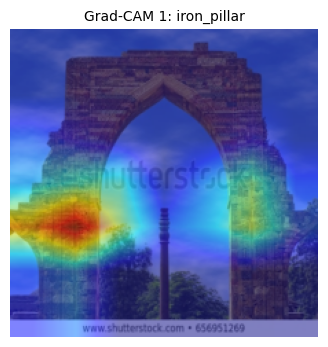

# 🏛️ MiniMonuNet

A lightweight deep learning model that classifies **24 iconic Indian landmarks** from images — even blurry or low-quality ones — using a fine-tuned ResNet model and Grad-CAM for visual explanation.

---

## 📌 About the Project

MiniMonuNet is a beginner-friendly computer vision project built to recognize and classify Indian monuments using transfer learning. It also includes **Grad-CAM visualizations** to show which regions of the image influenced the model’s prediction.

This project was designed to be lightweight and easy to run on limited hardware (Google Colab / local machine).

---

## 🗂️ Dataset

The dataset contains images of 24 Indian landmarks sourced from a Kaggle dataset.  
*Note: The dataset is not included in the repository. Please download from [Kaggle Link](#) https://www.kaggle.com/datasets/danushkumarv/indian-monuments-image-dataset

---

## ⚙️ Project Structure

MiniMonuNet/
├── app/
│ └── streamlit_app.py # Streamlit frontend app
├── model/
│ ├── best_model.pth # Trained ResNet weights
│ └── class_map.json # Class label mapping
├── gradcam_outputs/
│ ├── gradcam_1.png # Grad-CAM visualizations
│ └── ...
├── notebook/
│ └── MiniMonuNet.ipynb # Colab notebook (training + analysis)
├── requirements.txt # All required dependencies
└── README.md # Project documentation


🧠 Model Details
Base Model: ResNet18 (transfer learning via torchvision.models)

Accuracy: ~85% test accuracy after 5 epochs

Explainability: Grad-CAM used to highlight class-relevant image regions

Optimized for simplicity and clarity — ideal for learning and quick demos.


## 🚀 How to Run

### 📓 Run Notebook

Open the Jupyter/Colab notebook:

```bash
notebook/MiniMonuNet.ipynb

🌐 Run Streamlit App
Install dependencies:
pip install -r requirements.txt

Then launch the Streamlit app:
cd app
streamlit run streamlit_app.py


🎯 Possible Use Cases
Educational tools on Indian heritage

Mobile apps for monument recognition

Lightweight CV pipeline for tourism or AR applications


📸 Grad-CAM Example
<div align="center">  </div>
<div align="center">  </div>


🛠️ Future Improvements
Expand dataset to include global landmarks

Integrate model into mobile apps

Enhance frontend UI and add search/filter options


📬 Contact
Made by Mitali Giri [https://github.com/MitaliGiri]
For suggestions, collaborations, or feedback — feel free to reach out!